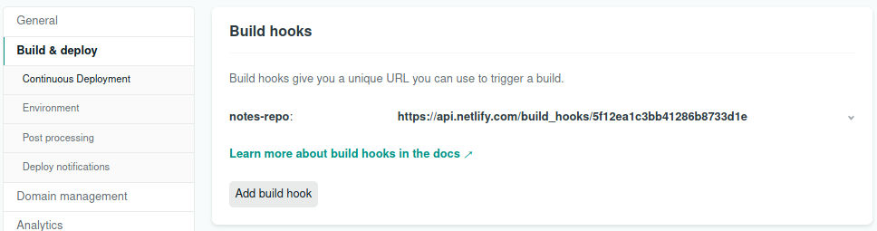
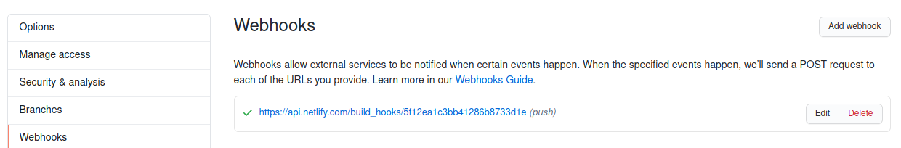

# Webhooks in Netlify
A webhook is automatically addded between Netlify and GitHub when you connect a repository to a Netlify site. This guide aims to show how to add a webhook to *another* repository, enabling deploys of a site based on updates to *any* of your repositories.

## Motivation
Sourcing data from external repositories is very powerful. It allows you to keep the data separated from your front-end without using a traditional database approach. This works very well with simple data, without complex relations and permissions.

The example here uses a separate repo for markdown files (blog posts) for which an update will trigger the deploy of the front-end (gelotte.dev).

## Adding the webhook

### 1. Create a new webhook in Netlify

### 2. Add the webhook to repo in GitHub

### 3. Enjoy
